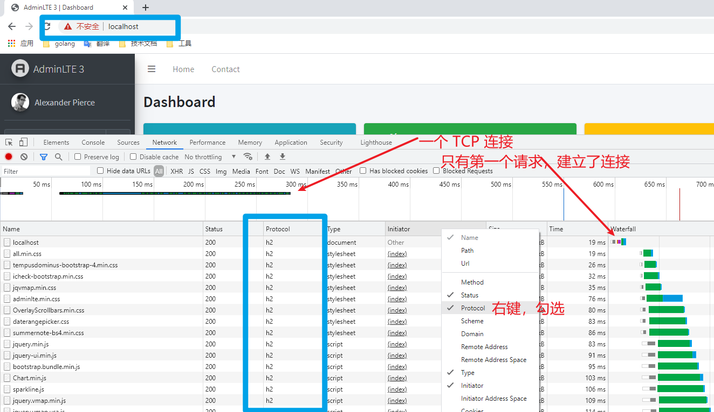

# HTTP Server

## 搭建 HTTP/2 服务器

### 安装 http_v2 模块

Nginx 需要 `http_v2_module` 和 `http_ssl_module` 的支持，需要 Nginx >= 1.9.5。

命令 `nginx -V` 可以确定版本和安装了某个模块：

```sh
root@cd13571cd8c1:/# nginx -V
nginx version: nginx/1.21.1
built by gcc 8.3.0 (Debian 8.3.0-6)
built with OpenSSL 1.1.1d  10 Sep 2019
TLS SNI support enabled
configure arguments: --prefix=/etc/nginx --with-http_ssl_module --with-http_v2_module ...
# 其他配置项略
```

若未安装相应模块，编译安装时需要使用下面的参数进行配置：

```
./configure --with-http_ssl_module --with-http_v2_module
make && make install
```

windows 下的二进制发行版，内置了该模块，直接使用即可！ 

### 配置服务，启用 h2

示例配置：

```nginx
server {
    listen 443 ssl http2;

    ssl_certificate server.crt;
    ssl_certificate_key server.key;
}
```

我们仅仅需要在 `listen` 指令中增加 `http2` 选项即可，非常 easy！

### 配置 SSL

说明以下：

HTTP/2 本身并不是一定需要 SSL 的支持，但当前的浏览器在实现 HTTP/2 时，都选择实现的必须加密传输的版本，因此我们的服务器也需要使用加密传输的方式。其中 HTTP/2 + SSL 称为 `h2`，而非加密的 HTTP/2 称为 `h2c`，可见我们搭建的是 h2 服务器。

如果我们自己来实现 HTTP/2 的客户端，那么可以使用 h2c ，就可以不处理 SSL 相关内容了。

我们还需要配置 SSL，在 `listen` 指令增加 `ssl` 选项，并配置证书和密钥，SSL 默认未 443 端口。：

```nginx
server {
    listen 443 ssl http2;

    ssl_certificate server.crt;
    ssl_certificate_key server.key;
}
```

测试环境可以利用 [mkcert](../tools/mkcert.md) 来安装 CA 和证书，生产环境需要使用公开的 CA 颁发的证书，例如 [Let's Encrypt](../tools/lets-encrypt.md) 。

当配置 SSL 时，考虑加密安全问题，通常还要做出一些限制，例如加密传输协议的选择，加密算法的选择等：

```nginx
server {
    ssl_protocols TLSv1 TLSv1.1 TLSv1.2;    #安全链接可选的加密协议
    ssl_ciphers ECDHE-RSA-AES128-GCM-SHA256:ECDHE:ECDH:AES:HIGH:!NULL:!aNULL:!MD5:!ADH:!RC4;    #加密算法
    ssl_prefer_server_ciphers on;   #使用服务器端的首选算法
}
```

还可以增加 ssl 缓存，来提速：

```nginx
server {
    ssl_session_timeout  5m;    # 缓存有效期
    ssl_session_cache shared:SSL:10m;   # 缓存大小
}
```

### 浏览器测试

服务器端配置完毕，可以通过浏览器测试了，目前主流的浏览器都支持 h2 请求。直接在地址栏中 `https://loacalhost/` 即可，注意是 https。



```

```

通过 network 监控可见，使用的协议为 h2。没有该列的话，右键勾选。

地址栏中出现不安全提示，表示我们使用的是 https，但浏览器端没有相应证书。这个可以忽略，因为我们使用的是测试环境。

至此，我们就搭建好了！

除了 h2 协议外，我们还可以看到，这么多请求，仅仅使用一个连接。

### 为什么浏览器知道需要使用 h2 协议来请求呢？

我们在浏览器端，未作任何关于 h2 的处理，与 HTTP/1.1 的请求方式一致，浏览器是如何区分该服务器是 h2 呢？

答案是在 SSL 连接协商阶段，浏览器和服务器确认了应该使用 h2 协议。

OpenSSL 1.0.2 后，内置了 ALPN 协议，该协议叫作应用层协议协商，是 TLS 的扩展，利用该协议，可以完成 h2 的协议升级协商工作。早一点还有 NPN 协议也可以协商，但已经过时了。

### HTTP2 相关配置

除了以上 nginx 常规配置外，http/2 还支持下面的指令，视具体情况来使用：

```nginx
http2_body_preread_size
http2_chunk_size
http2_idle_timeout
http2_max_concurrent_pushes
http2_max_concurrent_streams
http2_max_field_size
http2_max_header_size
http2_max_requests
http2_push	# 推送资源
http2_push_preload
http2_recv_buffer_size
http2_recv_timeout
```

还有一个内置变量：

```nginx
$http2
```

