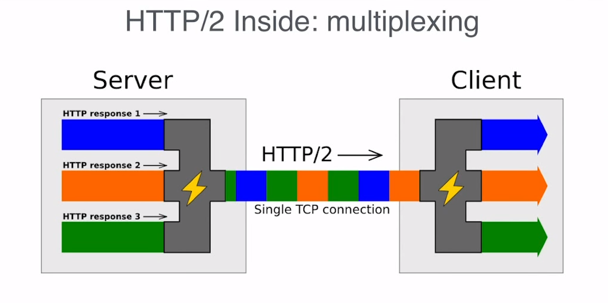
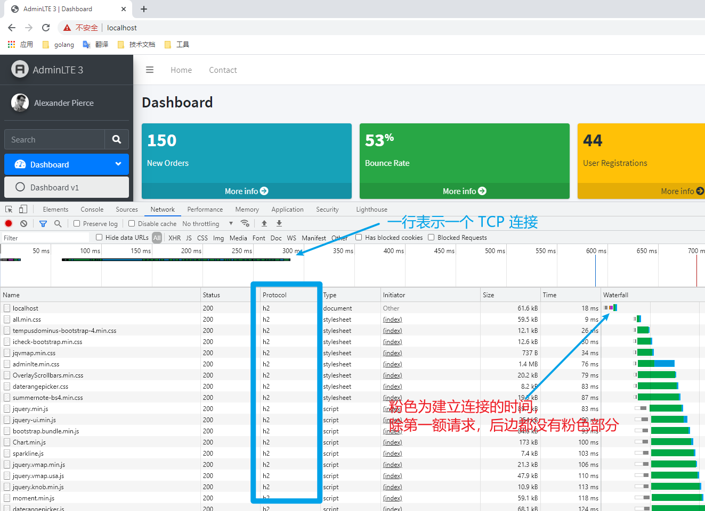
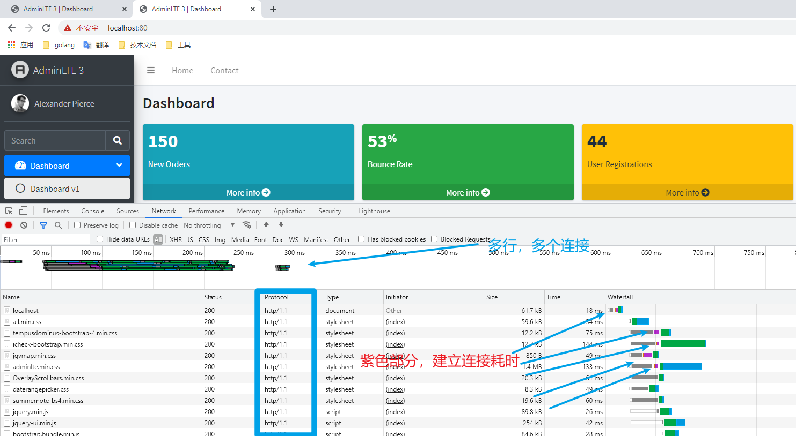
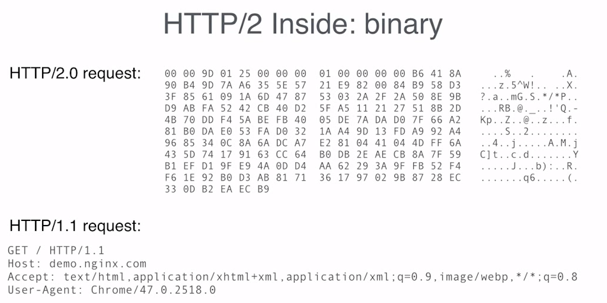

# HTTP/2

Homepage: [https://http2.github.io/](https://http2.github.io/)

官方文档：

- [RFC7540](https://httpwg.org/specs/rfc7540.html)，HTTP2
- [RFC7541](https://httpwg.github.io/specs/rfc7541.html)，HPACK -  HTTP/2 的头压缩

## 初见 HTTP/2

2014年12月，互联网工程任务组（IETF）的 Hypertext Transfer Protocol Bis（httpbis）工作小组将 HTTP/2 标准提议递交至 IESG 进行讨论，于2015年2月17日被批准。HTTP/2 标准于2015年5月以 RFC 7540 正式发表，成为 HTTP 新的实现标准。

HTTP/2 不是用来替代 HTTP/1 的，而是用来提升 HTTP 的传输效率。HTTP/2 并没有重写 HTTP 协议，HTTP 请求方式、响应状态码、和其他 API 等应用层面都与 HTTP/1 是相同的。应用逻辑层面是一致的。

这项工作的基础是 SPDY，加入了一些改进。

> 谷歌于2009年公开了 SPDY 协议，W3C 将 SPDY 协议引入到 HTTP 协议中

## 主要特性

HTTP/2 的主要升级是性能方面。最主要的改进是使用单个 TCP 连接来完成 C/S 端的全部会话通讯，使用二进制消息帧编码数据，支持多工通讯来提升传输效率。

### 多路复用，Multiplexing

先借用一张来自 Nginx 官网的图：

HTTP/2 不是通过多个连接来处理多个请求和响应数据流的，而是通过一个连接来实现多个请求和响应的数据流的。它将不同的请求和不同的响应切片数据，同时并发地在一个连接中传输，每个切片都有自己的标识和大小字段，这样端点就可以确定哪个数据属于哪个请求。这些数据切片在 HTTP/2 中称为帧（frame）。

相对于 HTTP/1.1，虽然也支持长连接，但一个连接最多可以处理 6 个左右的请求。而且请求需要排队，一个请求完毕，另一个请求/响应才可以利用该连接进行发送。

使用一个 TCP 连接，大大降低了 TCP 建立连接的开销。我们都知道 TCP 是可靠连接，需要三次握手连接，双向确认关闭等复杂操作！尤其是当我们使用 TLS 连接时，建立连接的成本就更高了（比简单的 TCP 连接高不少），这种多连接的额外消耗就显得极为庞大，迫切需要处理！也是这个原因，主流浏览器实现的 HTTP/2 都是基于 TLS 上的，也就是 HTTPS 协议的 HTTP/2 连接，我们用 `h2` 标识。

>  HTTP/2 分为 h2 和 h2c，h2 为 HTTP/2 + TLS，而 h2c 仅为 HTTP/2 。

我们再通过浏览器的网络监控面板看一下，HTTP/1.1 和 HTTP/2 的连接情况：

HTTP/2

HTTP/1.1

连个站点，除了启用 http/2 外，全部相同，都是 https 请求，都是一样的资源。大家可以清晰的看到，http/2 使用了一个连接，而 http/1.1 使用了5个连接，而且若资源增加，连接数量也会随之增加。

分析可知，也有一些缺点，比如由于每个数据切片（帧）都有自己的标识、自己的字段，因此除了实际数据之外，还需要传输一些元数据，它有一定的额外开销。因此，如果您只有一个请求/响应数据流，例如看电影，下载文件，那么 HTTP/2 就不是一个好的协议，因为不需要额外的数据切片。

### 二进制编码，Binary

HTTP/2 在传输数据时，除了把数据切片为帧外，还会对数据进行二进制编码，无论是 Headers 还是 Body。对应的 HTTP/1.1 是采用字节编码。

二进制编码的特点：

- 解析成本大大降低
- 减少额外编码大量的冗余数据，数据体积变小
- 可读性差，不容易调试，这说的是人类（具体说是 IT 民工，认证了的）。机器自己读着很爽！

来一张编码比较图：

其实，编码不同，我们一般在调试时也感受不到。即使是二进制编码，我们在乎的是最终的结果，也就是 HTTP 解码之后的结果！说白了，即使是 h2，即使是 https，我们还是可以在浏览器的调试工具中，看到我们发出的请求，以及收到的响应！

对于，做底层抓包分析的工作人员，难度就提升了，例如我们用 wireshark 去抓包，就不容易分析据提内容了。当然了，这也和采用 TLS 传输（HTTPS）有关！