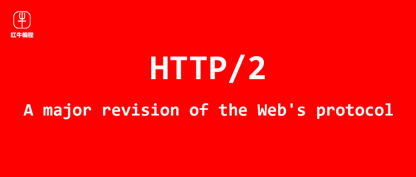

# HTTP/2

Homepage: [https://http2.github.io/](https://http2.github.io/)

官方文档：

- [RFC7540](https://httpwg.org/specs/rfc7540.html)，HTTP2
- [RFC7541](https://httpwg.github.io/specs/rfc7541.html)，HPACK -  HTTP/2 的头压缩

## 初见 HTTP/2

2014年12月，互联网工程任务组（IETF）的 Hypertext Transfer Protocol Bis（httpbis）工作小组将 HTTP/2 标准提议递交至 IESG 进行讨论，于2015年2月17日被批准。HTTP/2 标准于2015年5月以 RFC 7540 正式发表，成为 HTTP 新的实现标准。

HTTP/2 不是用来替代 HTTP/1 的，而是用来提升 HTTP 的传输效率。HTTP/2 并没有重写 HTTP 协议，HTTP 请求方式、响应状态码、和其他 API 等应用层面都与 HTTP/1 是相同的。应用逻辑层面是一致的。

这项工作的基础是 SPDY，加入了一些改进。

> 谷歌于2009年公开了 SPDY 协议，W3C 将 SPDY 协议引入到 HTTP 协议中

## 主要特性

HTTP/2 的主要升级是性能方面。最主要的改进是使用单个 TCP 连接来完成 C/S 端的全部会话通讯，使用二进制消息帧编码数据，支持多工通讯来提升传输效率。

### 多路复用，Multiplexing

先借用一张来自 Nginx 官网的图：


HTTP/2 不是通过多个连接来处理多个请求和响应数据流的，而是通过一个连接来实现多个请求和响应的数据流的。它将不同的请求和不同的响应切片数据，同时并发地在一个连接中传输，每个切片都有自己的标识和大小字段，这样端点就可以确定哪个数据属于哪个请求。这些数据切片在 HTTP/2 中称为帧（frame）。

相对于 HTTP/1.1，虽然也支持长连接，但一个连接最多可以处理 6 个左右的请求。而且请求需要排队，一个请求完毕，另一个请求/响应才可以利用该连接进行发送。

使用一个 TCP 连接，大大降低了 TCP 建立连接的开销。我们都知道 TCP 是可靠连接，需要三次握手连接，双向确认关闭等复杂操作！尤其是当我们使用 TLS 连接时，建立连接的成本就更高了（比简单的 TCP 连接高不少），这种多连接的额外消耗就显得极为庞大，迫切需要处理！也是这个原因，主流浏览器实现的 HTTP/2 都是基于 TLS 上的，也就是 HTTPS 协议的 HTTP/2 连接，我们用 `h2` 标识。

>  HTTP/2 分为 h2 和 h2c，h2 为 HTTP/2 + TLS，而 h2c 仅为 HTTP/2 。

我们再通过浏览器的网络监控面板看一下，HTTP/1.1 和 HTTP/2 的连接情况：

HTTP/2


HTTP/1.1


两个站点，除了启用 http/2 外，全部相同，都是 https 请求，都是一样的资源。大家可以清晰的看到，http/2 使用了一个连接，而 http/1.1 使用了5个连接，而且若资源增加，连接数量也会随之增加。

分析可知，也有一些缺点，比如由于每个数据切片（帧）都有自己的标识、自己的字段，因此除了实际数据之外，还需要传输一些元数据，它有一定的额外开销。因此，如果您只有一个请求/响应数据流，例如看电影，下载文件，那么 HTTP/2 就不是一个好的协议，因为不需要额外的数据切片。

### 优先级，Prioritization

浏览器在渲染应用页面时需要加载很多资源，这些资源本身就有重要程度的差异，优先加载重要资源有利于浏览器更高效快速地渲染必要的部分，尽快展示给用户，提升用户体验。HTTP/2 采用多路复用技术，同一源（服务器）的全部资源使用一个连接完成发送，为了避免线头堵塞，这时候资源传输的顺序就尤为重要！

> 线头堵塞，HOB，Head Of Line Blocking，队列前面的 packet 由于某些原因被延迟，进而会导致后面的 packets 被 blocked 的现象。就像前面出现交通状况了，后边会堵车。

HTTP/2 允许我们在获取资源时，指定资源的权重，进而通知服务器，那些资源应该优先传输。通常我们什么都不需要做，浏览器和 HTTP/2 服务器已经帮我们处理好了具体的细节。

影响优先级的指标主要是：权重（weight）和依赖关系（parent）。

浏览器在请求时，通常会依赖资源类型给出权重，在请求的 HEADERS 帧和 PRIORITY 帧中传输到服务器端。通常来说，html 请求权重最高，css、images、js、fonts 相对低一些，通常是静态分配的。而依赖关系由资源的 Referer 来确定。

服务器在获取到资源的优先相关信息时，会据此构建优先级树，来指导服务器的资源分配，包括 CPU、Memory、带宽等。优先级树，会依赖资源的依赖关系，资源权重，parent 资源权重等来确定。

传输数据时，现根据依赖关系层级选择，当依赖层级相同时，在根据计算出来的**相对权重**选择。

```c
// **相对权重**大概的计算方式如下：
相对权重 = 资源权重 * 上级资源相对权重
```

在多路复用上，有了资源的传输权重，岂不是如虎添翼！

### 头部压缩，Header Compression

HTTP 请求时，头部往往会出现大量的重复信息。例如若有大量的 cookie，每次浏览器向服务器请求时，都会携带大量的且内容相同的 cookie，是不是造成了带宽传输的浪费？再比如 UserAgent，很长一段代理信息，但是从开始到结束，这个值是不变的，没有必要反复的传输。

HTTP/2 头压缩算法为 HPACK，思路是将请求和响应头中特定的关键字给编上索引号码，这样在传输固定内容时，仅仅需要传输索引号码即可，因为 B/S 两端都可以利用该这个索引号码来确定头内容是什么。

例如：静态表

| Index  | Header Name | Header Value         |
| ------ | ----------- | -------------------- |
| 2      | :method     | GET                  |
| 3      | :method     | POST                 |
| ...... | ......      | ......               |
| 8      | :status     | 200                  |
| 13     | :status     | 404                  |
| 33     | date        |                      |
| 58     | user-agent  | 可变的 user-agent 值 |
| ....   |             |                      |

这样，当浏览器发送 GET 方式请求时，仅仅需要在头帧（Frame）中发送数字 2，即可代表 GET method。同样当服务响应 200 状态码时，就可以直接返回 8 就ok了。当值不能预定义时，会把头字段对应的值存储到对应的 Header value 中。这张表称为**静态表:**。完整静态表见附录。

存储非预定义头（例如 `x-powered-by`）时，会使用另一张结构类似的表， 称为**动态表**。也会将每对头 Name:Value 做成索引。

例如，动态表：

| Index  | Header Name  | Header Value |
| ------ | ------------ | ------------ |
| 68     | x-powered-by | some value   |
| ...... | ......       | ......       |

两个表结合，HPACK 就得到了全部使用的头 Name:Value 的索引集合。这个索引集合，B、S 两端同时维护，内容保持一致。这样，B/S 在传输时，仅仅需要传输索引号和变化的值即可，不在需要传递大量的重复数据了。

除此之外，传输数据时，头部还会采用静态霍夫曼编码来压缩数据，减少体积。

看一张图：来自 https://www.oreilly.com/


上图中，演示了一个请求头，基于静态表，形成编码后的请求头实体的过程，其中：

- 2，7，62，就是静态表的索引，只需要传递索引号即可，B、S 两端都知道内容时什么
- 19，value 是新的，name 是索引19对应的，value 采用了 huffman 编码
- 最后还有一组自定义的 name:value 对，都采用了 huffman 编码

再看一图：来自 https://www.oreilly.com/


上图中，请求 #2， 所需要发送的头仅有一条即可，因为其他的头未发生改动，只需要将改动发送即可！

### 二进制编码，Binary

HTTP/2 在传输数据时，除了把数据切片为帧外，还会对数据进行二进制编码，无论是 Headers 还是 Body。对应的 HTTP/1.1 是采用字节编码。

二进制编码的特点：

- 解析成本大大降低
- 减少额外编码大量的冗余数据，数据体积变小
- 可读性差，不容易调试，这说的是人类（具体说是 IT 民工，认证了的）。机器自己读着很爽！

来一张编码比较图：


其实，编码不同，我们一般在调试时也感受不到。即使是二进制编码，我们在乎的是最终的结果，也就是 HTTP 解码之后的结果！说白了，即使是 h2，即使是 https，我们还是可以在浏览器的调试工具中，看到我们发出的请求，以及收到的响应！

对于，做底层抓包分析的工作人员，难度就提升了，例如我们用 wireshark 去抓包，就不容易分析具体内容了。当然了，这也和采用 TLS 传输（HTTPS）有关！

## 附录

### 静态表

预定义的头字段，及索引号

| Index | Header Name                 | Header Value  |
| ----- | --------------------------- | ------------- |
| 1     | :authority                  |               |
| 2     | :method                     | GET           |
| 3     | :method                     | POST          |
| 4     | :path                       | /             |
| 5     | :path                       | /index.html   |
| 6     | :scheme                     | http          |
| 7     | :scheme                     | https         |
| 8     | :status                     | 200           |
| 9     | :status                     | 204           |
| 10    | :status                     | 206           |
| 11    | :status                     | 304           |
| 12    | :status                     | 400           |
| 13    | :status                     | 404           |
| 14    | :status                     | 500           |
| 15    | accept-charset              |               |
| 16    | accept-encoding             | gzip, deflate |
| 17    | accept-language             |               |
| 18    | accept-ranges               |               |
| 19    | accept                      |               |
| 20    | access-control-allow-origin |               |
| 21    | age                         |               |
| 22    | allow                       |               |
| 23    | authorization               |               |
| 24    | cache-control               |               |
| 25    | content-disposition         |               |
| 26    | content-encoding            |               |
| 27    | content-language            |               |
| 28    | content-length              |               |
| 29    | content-location            |               |
| 30    | content-range               |               |
| 31    | content-type                |               |
| 32    | cookie                      |               |
| 33    | date                        |               |
| 34    | etag                        |               |
| 35    | expect                      |               |
| 36    | expires                     |               |
| 37    | from                        |               |
| 38    | host                        |               |
| 39    | if-match                    |               |
| 40    | if-modified-since           |               |
| 41    | if-none-match               |               |
| 42    | if-range                    |               |
| 43    | if-unmodified-since         |               |
| 44    | last-modified               |               |
| 45    | link                        |               |
| 46    | location                    |               |
| 47    | max-forwards                |               |
| 48    | proxy-authenticate          |               |
| 49    | proxy-authorization         |               |
| 50    | range                       |               |
| 51    | referer                     |               |
| 52    | refresh                     |               |
| 53    | retry-after                 |               |
| 54    | server                      |               |
| 55    | set-cookie                  |               |
| 56    | strict-transport-security   |               |
| 57    | transfer-encoding           |               |
| 58    | user-agent                  |               |
| 59    | vary                        |               |
| 60    | via                         |               |
| 61    | www-authenticate            |               |