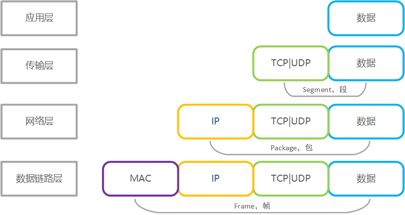
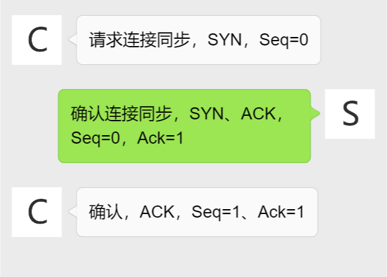
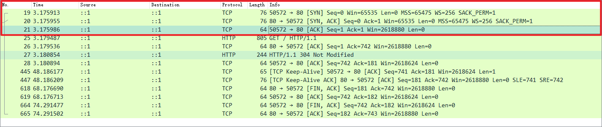
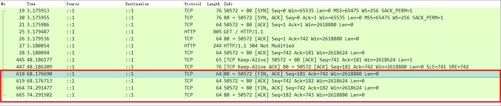
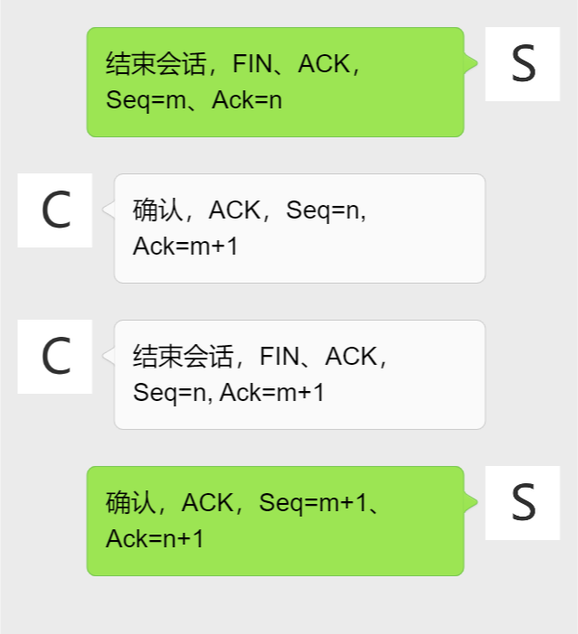
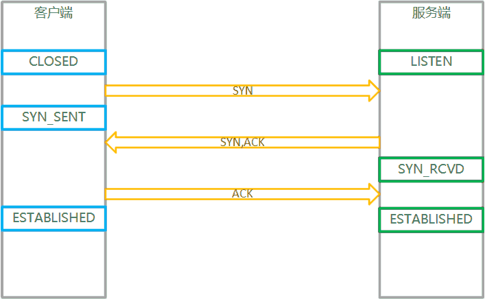
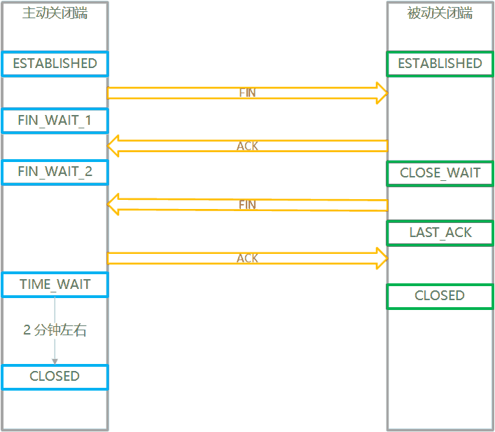
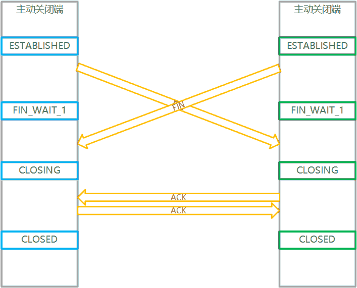
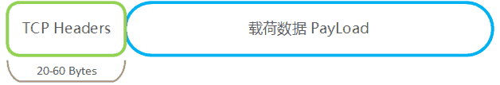
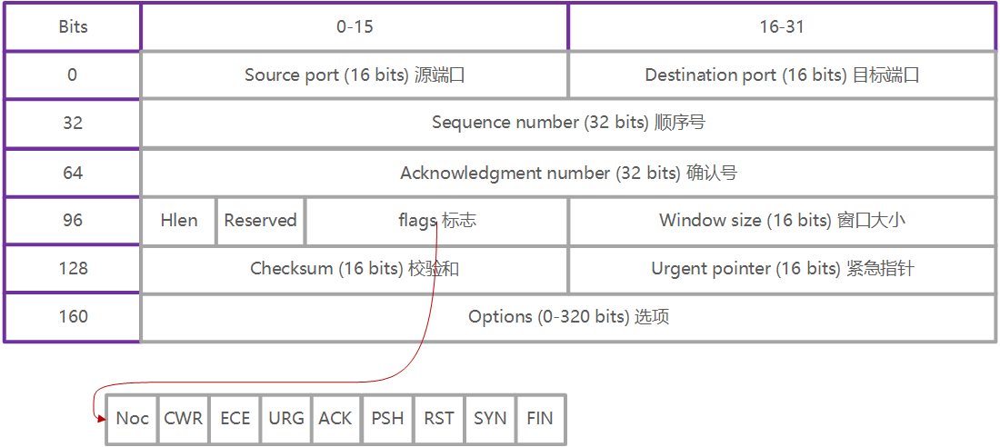

# TCP

[[toc]]

## 初见 TCP

TCP是传输控制协议 (Transmission Control Protocol) 的缩写，它是一种通信标准，使应用程序和计算设备能够在网络上交换消息。它被设计用于在互联网上发送数据包，并确保通过网络成功传递数据和消息。

TCP 是定义 internet 规则的基本标准之一，是 internet 工程任务组 (internet Engineering Task Force, IETF) 定义的标准之一。它是数字网络通信中最常用的协议之一，确保端到端数据传输。TCP组织数据，以便在服务器和客户端之间传输数据。

它保证了在网络上传输的数据的完整性。在传输数据之前，TCP 在源和目标之间建立连接，并确保在通信开始之前该连接一直存在。然后，它将大量数据分解成更小的数据包，同时在整个过程中确保数据完整性。因此，需要传输数据的高级协议都使用 TCP 协议。例如括点对点（peer-to-peer ）共享方法，如 FTP (File Transfer Protocol)、SSH (Secure Shell) 和 Telnet。它还可以通过 IMAP (Internet Message Access Protocol)、POP (Post Office Protocol)、SMTP (Simple Mail Transfer Protocol) 收发电子邮件，通过 HTTP (Hypertext Transfer Protocol) 访问 web。

TCP 的另一种选择是用户数据报协议 UDP，它用于在应用程序之间建立低延迟连接来减少传输时间。TCP 可能是一种昂贵的网络工具，因为它包含缺失或损坏的数据包，并通过确认、连接启动和流控制等控制来保护数据传输。UDP 不提供错误连接或包排序，也不发送信号的目的地之前，它交付的数据，这使它更不可靠，但更便宜。因此，对于时间敏感的情况，如域名系统 (DNS) 查找、互联网协议语音 (VoIP) 和流媒体，它是一个很好的选择。

## TCP 的4层网络模型

TCP/IP 模型定义了设备应该如何在它们之间传输数据，并允许通过网络和长距离通信。该模型表示数据如何在网络上交换和组织。它被分为四个层，为数据交换设置标准，并表示在应用程序、设备和服务器之间传递数据时如何处理和打包数据。

TCP/IP模型的四层结构如下: 

- **数据链层，Datalink layer**: 数据链层定义数据应该如何发送，处理发送和接收数据的物理行为，并负责在网络上的应用程序或设备之间传输数据。这包括定义如何通过硬件和网络上的其他传输设备(如计算机的设备驱动程序、以太网电缆、网络接口卡(NIC)或无线网络)发送数据。它也被称为链路层、网络接入层、网络接口层或物理层，是开放系统互连(OSI)模型的物理层和数据链路层的组合，该模型对计算和电信系统的通信功能进行标准化。
- **网络层，Internet layer**: 网络层负责从网络发送数据包，并控制它们在网络上的移动，以确保它们到达目的地。它提供了在应用程序和设备之间跨网络传输数据序列的功能和过程。
- **传输层，Transport layer**: 传输层负责在原始应用程序或设备与其预期目的地之间提供可靠的数据连接。在这一层，数据被分成包并编号以创建一个序列。然后，传输层决定必须发送多少数据，应该发送到哪里，以及以什么速率发送。它保证数据包按照正确的顺序发送，并得到目的设备已经接收到数据包的确认。
- **应用层，Application layer**: 应用层是指需要 TCP/IP 协议进行通信的程序。这是用户通常与之交互的级别，例如电子邮件系统和消息传递平台。它结合了 OSI 模型的会话层、表示层和应用层。

>  OSI（Open System Interconnect），即开放式系统互联。 一般都叫 OSI 参考模型，是 ISO（国际标准化组织）组织在1985年研究的网络互连模型。

| TCP/IP 模型的4层 | 常用协议            | 数据单位    | 相对于 OSI             |
| ---------------- | ------------------- | ----------- | ---------------------- |
| 应用层           | HTTP、FTP、SMTP     | 应用数据    | 应用层、表示层、会话层 |
| 传输层           | TCP、UDP            | 段，segment | 传输层                 |
| 网络层           | IP、ARP、RARP、ICMP | 包，package | 网络层                 |
| 数据链路层       | Ethernet            | 帧，frame   | 数据链路层、物理层     |

分层后，每层各司其职，互不干扰，层次封装: 



## TCP 的特性

- **可靠，Reliable**
  TCP 是一种可靠的协议，它遵循流程和错误控制机制。它还支持确认机制，该机制检查数据的状态和声音到达。在确认机制中，接收方向发送方发送确认或未未确认的信息，以便发送方知道数据包是否已被接收或需要重发。

- **数据完整有序，Order of the data is maintained**
  该协议确保数据完整地以发送的相同顺序到达预期的接收者。它对每个段进行排序和编号，以便目的端 TCP 层可以根据它们的顺序重新组装它们。
- **面向连接，Connection-oriented**
  它是一个面向连接的服务，这意味着数据交换只在连接建立之后发生。当数据传输完成时，连接将被终止。
- **全双工，Full duplex**
  它是一个全双工意味着数据可以在同一时间在两个方向传输。
- **面向流，Stream-oriented**
  TCP是一种面向流的协议，因为它允许发送方以字节流的形式发送数据，也允许接收方以字节流的形式接收数据。TCP创建了一个环境，在这个环境中发送方和接收方都通过一个被称为虚拟电路的假想管连接。这个虚拟电路在互联网上携带字节流。

## 三次握手建立连接， Three-way handshaking

TCP 数据传输端分为发送端 Sender 和接收端 Receiver。通常发送端是客户端 Client 而接收端为服务端 Server。。

TCP 建立连接的过程如下: 

1. 第一步，客户端向服务端发送连接同步请求，数据段中包含标志 SYN  表示连接同步。
2. 第二步，服务端收到后，向客户端发送确认建立连接的消息。该消息带有标志 SYN 和 ACK 标志，表示确认连接，其中 ACK 表示确认。
3. 第三步，客户端收到后，再向服务端发送收到确认连接的消息。该消息带有标志 ACK 来表示确认收到。

以上三步，就是 TCP 连接建立的三次握手。就像两个人在对话: C(Client), S(Server)



再详细一些，TCP 在传递数据时，每个数据段都有顺序号 Sequence number 表示所荷载数据的字节起始序号，用 Seq=N 表示。

当数据段是确认数据时，也就是带有 ACK 标志的数据段时，需要包含确认号 Acknowledgment number 用 Ack=N 表示。Ack=N 表示确认接收到了 N-1 序列号的数据，同时期望下一次接收序列号 N 的数据。

上图中: 

- 第一步 C 的 Seq=0 表示 C 的数据段顺序号是 0
- 第二步 S 的 Ack=1 表示确认 C 发送的 Seq=0 的数据段、Seq=0 表示 S 的数据段顺序号是 0
- 第三步 C 的 Ack=1 表示确认 S 发送的 Seq=0 的数据段、Seq=1 表示 S 的数据段顺序号是 1

通过 [WireShark](../tools/wireshark.md) 工具来看一下，这个过程: 



以上截图来自 WireShark 抓取本地 HTTP 请求。请求的第一步，就是建立 TCP 连接。红框圈出的就是三次握手的过程，我们可以清晰的看到，有三个步骤，以及携带的标志和核心数据。

至此，TCP 的客户、服务两端就建立了可靠的连接。可以完成数据传输了。

## 双向终止关闭连接，two-way termination

当不再需要使用 TCP 连接，或连接超时时，会终止关闭连接。TCP 采用的时双向终止的策略来关闭连接。双向终止，指的是，客户端和服务端双方都会向对方发送一个终止数据段，来表示终止连接。由任何一端发起都可以，另一端再次发送一次即可。

双向终止的步骤总结如下，我们以由服务端发起为例（客户端亦然）: 

- 服务端发送一个 FIN 标志来通知客户端它不再想发送数据。FIN 标志表示结束会话
- 客户端确认收到终止数据段。确认需要 ACK 标志，以及 Ack=N 来说明确认的是哪条数据段
- 当客户端完成数据传输后，还会发送一个带有 FIN 标志的数据段。
- 服务端发送确认收到终止操作的数据段。同样需要 ACK 标志和 Ack=N

通过 WireShark 来查看以下: 



以上截图来自 WireShark 抓取本地 HTTP 请求，当连接超时时，由服务端主动发起结束。红框圈出的就是双向终止的过程，可以看到: 

- 先是 80 -> 50572 通知后 50572 -> 80 确认
- 再是 50572 -> 80 通知后  80 -> 50572 确认

还是用两个人对话，那就是: 



还有，最后发送 ACK 的端（本例中是 S 端）连接不会立即终端，会保持一会，以保证最后的数据段被接收，RFC 793 中规范的是 2 分钟。

### 半开连接 Half-Open Connection

若 A 端发送了 FIN 数据段，B 端 ACK 之后，B 端还允许继续向 A 端发送数据段，这个状态称为半开连接。

半开状态下，B 端可以将全部数据发送完毕后，再向 A 端发送 FIN 数据段，表示关闭连接。

## TCP 连接状态

在 TCP 两端，建立连接、发送数据和断开连接的过程中，TCP 的状态是随之转换的，存在如下11种状态: 

1. CLOSED: 连接关闭，初始状态
2. LISTEN: 监听，TCP 端口监听状态
3. SYN_SENT: 同步发送，客户端 SYN 段发送后，客户端的连接进入该状态
4. SYN_RCVD: 同步接收，服务端收到客户端的 SYN 段后，向客户端发送 SYN-ACK 确认段后，服务端进入该状态 
5. ESTABLISHED: 建立连接，客户端接收到服务端发送的 SYN-ACK 段后，向服务端发送 ACK 段确认，此时客户端变为 ESTABLISHED 状态，当服务端接收到客户端发送的 ACK 段后，服务端同样变为 ESTABLISHED 状态。ESTABLISHED 状态后，客户端与服务端就可以发送应用数据了。
6. FIN_WAIT_1: 结束等待1，主动关闭端（服务端、客户端都可以）要关闭连接时，会发送 FIN 段到被动关闭端。此时主动关闭端转为 FIN_WAIT_1 状态，表示等待被动关闭端确认
7. FIN_WAIT_2: 结束等待2，主动关闭端若接收到了被动关闭端发送的关于 FIN 的 ACK，则主动关闭端转为 FIN_WAIT_2 状态，表示等待被动关闭端方向的 FIN 段。
8. TIME_WAIT: 持续等待，主动关闭端若接收到了被动关闭端方向的 FIN 段，给被动关闭端 ACK 确认，此时主动关闭端转为 TIME_WAIT 状态，表示等待被动关闭段 ACK 确认段接收完成，这个等待时间为 2 分钟左右，后主动关闭端进入 CLOSED 关闭状态。 
9. CLOSE_WAIT: 关闭等待，被动关闭端接收到了主动关闭端发送的 FIN 段后，向主动关闭段发送 ACK 确认，之后被动关闭端进入 CLOSE_WAIT 状态，会继续将未发送完的数据段发送到另一端，然后向主动关闭端发送 FIN 段
10. LAST_ACK: 最后确认，被动关闭端把 FIN 发送给主动关闭端后，进入 LAST_ACK 状态，表示等待最后的确认，一旦接收到了主动关闭端的 ACK，则被动关闭端进入 CLOSED 状态，连接关闭
11. CLOSING: 由于 TCP 是全双工协议，意味着可能出现客户端和服务端都是主动关闭端，也就是两端同时向对方发送了 FIN 段，此时双方都进入 FIN_WAIT_1 状态，都在等待对方的 ACK 确认。但未等到 ACK 确认，等到的却是对方的 FIN 段，此时就进入 CLOSING 状态，之后向对方发送 ACK 确认后，直接都进入 CLOSED 状态，连接关闭

配合示意图，进行了解: 

建立连接时的状态转变: 



关闭连接时状态的改变: 



CLOSING 状态示意图: 



## TCP 头结构

通常，TCP 段的头包含使用传输控制协议进行连接和数据传输所需的元数据。这个头数据(包含控制信息)位于要传输的有效负载之前，大小通常为20字节(160位)。紧随其后的是多达40字节(320位)的选项信息，这是可选的，并不是在所有包中都使用。

整体 TCP 数据结构图: 



TCP 头部结构图: 



字段说明: 

- 源端口号(16位): 发送端口号
- 目的端口(16位): 接收端口号
- 顺序号(32位): 顺序号指定附加的荷载数据的第一个字节的位置，或者在连接建立或终止时发送。它还用于在传输后验证和排序片段。
- 确认号(32位): 该字段包含发送方期望的下一个顺序号。在 ACK 标志时有效。
- Hlen(4位): Header Length，指定 TCP 头的长度，由于选项 “Options” 字段长度可变，因此头总长度可变在 20-60 范围内。头的长度也说明了荷载数据的起始位置。
- Reserved: 预留，目前尚未使用。该字段必须始终设置为0，预留的位数当前版本为 2 位。
- Flags(9位): 标志，不同标志位置一表示设置，具体标志位含义: 
  1. Noc: Nonce， 随机数
  2. CWR: Congestion Window Reduced，拥塞窗口缩减（发送方降低它的发送速率）。
  3. ECE: ECN-Echo，ECN回显（发送方接收到了一个更早的拥塞通告）
  4. URG: Urgent，紧急（紧急指针字段有效，很少用）
  5. ACK: Acknowledgment 确认
  6. PSH: Push 推送（几乎没被用到）
  7. RST: Reset 重置连接（连接取消）
  8. SYN: 同步连接
  9. FIN: 结束发送
- Window Size 数据窗口大小(16位): 它包含接收方可以接受的数据大小。该字段用于发送方和接收方之间的流量控制，还决定了接收方为一个段分配的缓冲区的数量。这个字段的值由接收方决定。
- 校验和(16位): 传输控制协议能够可靠地检测传输错误。由报头、有效负载数据和伪报头来计算，该校验算法与 IP、ICMP、UDP 校验算法一致。
- 紧急指针(16位): 紧急指针表示需要紧急处理的荷载数据的第一个字节的位置。该字段只有在设置了 URG 标志时才有效和相关。
- Options(0 - 320位): 它提供了额外的选项。可选字段用32位表示。如果该字段包含小于32位的数据，则需要填充以获得剩余的位。

### 常见选项

除了 TCP 头中包含的常规元数据外，在头选项中还可包含额外的内容。

选项中，除 NOP 和 EOL 是单字节外，其他选项都是由1字节 Kind、1字节 Length 和选项内容组成。

理论上，可以存在任意的选项，通常的实现会识别特定的选项，不能识别的选项会被忽略。

常用的选项说明如下: 

- EOL，End Of Option List, 选项列表结束，通常当选项列表结束时长度与头中的 Header Length 不匹配时添加
  - Kind: 0

- NOP，No-Operation，非操作，主要用来对齐选项数据
  - Kind: 1
- MSS，Maximum Segment Size，最大段尺寸，是 TCP 期望从对端接收的最大的数据段长度，仅指 TCP 数据长度，并不包含关联的 TCP 头和 IP 头的长度，通常会在对应的 SYN 段中通过 MSS option 通告对方自己的 MSS。
  - Kind: 2
  - Length: 4
- Window scala, 窗口伸展, 在长肥管道中, 当发送端 TCP 需要更大的接收窗口的时候,使用该选项进行扩展, 该选项的值表示原来窗口大小左移的大小, 也就是实际窗口=WindowSize << Shift count. 由于在建立连接时需要确定窗口大小, 因此该选项要在 SYN 包中发送.
  - Kind: 3
  - Length: 3
  - Shift count: 
- SACK-Permitted, SACK 机制是否存在的标识, 存在该选项, 表示当前端支持 SACK 扩展. 
  - Kind: 4
  - Length: 2

- SACK, 选择确认选项, SACK 扩展用来实现不连续数据段的高效重传功能. 用来表示已经接收的不连续的数据块信息.
- UTO, User TimeOut, 用户超时选项, 指明了 TCP 发送端愿意等待 ACK 确认的时间

### 示例

下面展示一个使用 [WireShark]() 获取的 TCP 数据段内容，该内容是建立连接的第二步，也就是服务端的 SYN-ACK 段：

```
Frame 20: 76 bytes on wire (608 bits), 76 bytes captured (608 bits) on interface \Device\NPF_Loopback, id 0
Null/Loopback
Internet Protocol Version 6, Src: ::1, Dst: ::1
Transmission Control Protocol, Src Port: 80, Dst Port: 50572, Seq: 0, Ack: 1, Len: 0
    Source Port: 80
    Destination Port: 50572
    [Stream index: 3]
    [TCP Segment Len: 0]
    Sequence Number: 0    (relative sequence number)
    Sequence Number (raw): 2023324573
    [Next Sequence Number: 1    (relative sequence number)]
    Acknowledgment Number: 1    (relative ack number)
    Acknowledgment number (raw): 1259542717
    1000 .... = Header Length: 32 bytes (8)
    Flags: 0x012 (SYN, ACK)
        000. .... .... = Reserved: Not set
        ...0 .... .... = Nonce: Not set
        .... 0... .... = Congestion Window Reduced (CWR): Not set
        .... .0.. .... = ECN-Echo: Not set
        .... ..0. .... = Urgent: Not set
        .... ...1 .... = Acknowledgment: Set
        .... .... 0... = Push: Not set
        .... .... .0.. = Reset: Not set
        .... .... ..1. = Syn: Set
        .... .... ...0 = Fin: Not set
        [TCP Flags: ·······A··S·]
    Window: 65535
    [Calculated window size: 65535]
    Checksum: 0x570b [unverified]
    [Checksum Status: Unverified]
    Urgent Pointer: 0
    Options: (12 bytes), Maximum segment size, No-Operation (NOP), Window scale, No-Operation (NOP), No-Operation (NOP), SACK permitted
        TCP Option - Maximum segment size: 65475 bytes
        TCP Option - No-Operation (NOP)
        TCP Option - Window scale: 8 (multiply by 256)
            Kind: Window Scale (3)
            Length: 3
            Shift count: 8
            [Multiplier: 256]
        TCP Option - No-Operation (NOP)
        TCP Option - No-Operation (NOP)
        TCP Option - SACK permitted
            Kind: SACK Permitted (4)
            Length: 2
    [SEQ/ACK analysis]
    [Timestamps]

```

