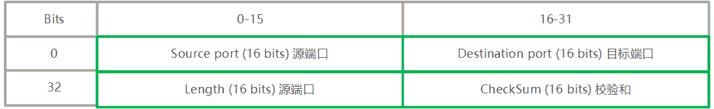

# UDP

## 初见 UDP

UDP ，User Datagram Protocol 用户数据报协议，与 TCP 一样都处于4层网络的传输层，基于网络层 IP 协议，也被称为 UDP/IP 协议族。

与 TCP 不同的是，UDP 是不可靠和无连接的协议（TCP 是可靠、有连接的），UDP 在数据传输之前不需要建立连接（联想 [TCP 的三次握手建立连接](./tcp.md)），数据传输后不需要确认。因此使用 UDP 传输，直接向目标发送，但不能保证数据一定被送达，就会出现所谓丢包的情况！

虽然 UDP 放弃了可靠性，但 UDP 得到了效率，也就是因为不需要做这些保证性的工作！

实际应用中，例如语音、视频通讯，某些游戏，是允许出现中间部分数据丢失的情况的，因此可以使用 UDP 来提升网络效率。

> 早期很多即时通讯应用，都会采用 UDP，因为早期还没有类似于 epoll 的技术， TCP 的成本太高了，选择 UDP 就要在应用层面保证数据的可靠性。

> DNS 也使用 UDP 协议

**UDP 和 TCP 没有好坏之分，只有是否合适之选！**

由于 UDP 的功能单一，因此结构就比 TCP 简单的多。

## UDP 头结构

UDP 整体结构为：


UDP 头是8字节的固定结构（TCP 的头20到60字节不等)。结构如下：



字段说明：

- Source Port  源端口: 2字节，用于标识源的端口号。
- Destination Port 目标端口: 2字节，用于标识目的端口。
- Length 长度: 2字节，包括头和数据在内的 UDP 数据长度。
- Checksum 校验和: 2字节，采用 UDP 头、IP 头和数据的伪报头计算的校验数字。非强制字段（TCP 的 CheckSum 是强制的）。

> UDP 本身不处理错误，UDP 依赖于 IP 和 ICMP 的错误报告

[WireShark](../tools/wireshark.md) 查看下，以下数据是 `ping qq.com` 时抓取的数据，ping qq.com 会触发 DNS 服务，DNS 是基于 UDP：

```
User Datagram Protocol, Src Port: 50742, Dst Port: 53
    Source Port: 50742
    Destination Port: 53
    Length: 32
    Checksum: 0x2ac7 [unverified]
    [Checksum Status: Unverified]
    [Stream index: 1]
    [Timestamps]
    UDP payload (24 bytes)
Domain Name System (query)
    Transaction ID: 0x461f
    Flags: 0x0100 Standard query
    Questions: 1
    Answer RRs: 0
    Authority RRs: 0
    Additional RRs: 0
    Queries
    [Response In: 114]

```

这个是 50742 -> 53 的 UDP 数据段，携带的数据 24 Bytes，加上头 8 Bytes 共 Length 32 Bytes。

结构比 TCP 的简单很多

## UDP 多播、广播

支持多播和广播是 UDP 很重要的特征。TCP 不支持多播和广播，仅支持单播。

- 多播，面向多个目标发送
- 广播，面向其余全部目标发送（慎用）
- 单播，面向单个目标发送

多播和广播都是一对多的数据发送方案！

通过不同类型的 IP 地址，来完成广播或多播，仅仅可以使用 UDP 来传输数据。

广播会使用如下的广播 IP 地址：

- 受限的广播: 255.255.255.255
- 指向网络的广播: netid.255.255.255, netid 为 A 类网络的网络号, 例如 10.255.255.255
- 指向子网的广播:10.1.1.255 10.1.255.255, 需要了解目标子网掩码
- 指向所有子网的广播: 10.255.255.255, 需要了解目标子网掩码

多播使用 D 类 IP 地址来表示多播组号,完成多播.

具体请参考 [IP 协议](./ip.md).

## TCP 和 UDP 的差异

这几乎是必考题，我们稍稍总结：

|          | TCP                            | UDP              |
| -------- | ------------------------------ | ---------------- |
| 连接     | 面向连接                       | 无需提前连接     |
| Header   | 20-60 Bytes                    | 8 Bytes          |
| 可靠     | 可靠                           | 不可靠           |
| 流量控制 | 支持，通过窗口大小             | 不支持           |
| 应用场景 | web 请求、文件传输、服务间通讯 | 视频传输、DNS    |
| 传播     | 单播                           | 单播、多播、广播 |
| 传输方式 | 面向字节流                     | 面向数据段       |
| 性能     | 低                             | 高               |
| 成本     | 高                             | 低               |

## UDP Flood Attack 洪水攻击

UDP Flood 是流量型 DoS(Denial of Service, 拒绝服务) 攻击的一种. 

常见的情况是利用大量 UDP 小包冲击使用 UDP 的服务器,例如冲击 DNS 服务器, 视频服务器等。

除此之外，也可利用 UDP 目标端口未被监听需要 ICMP 数据包的情况，对特定端口发送大量的 UDP 请求，进而通过大量的 ICMP 数据包耗尽系统资源的情况。

> 参考 [ICMP](./icmp.md)，Internet 控制报文协议