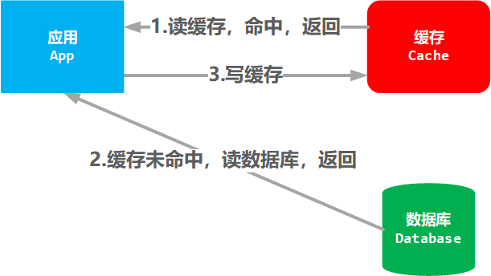
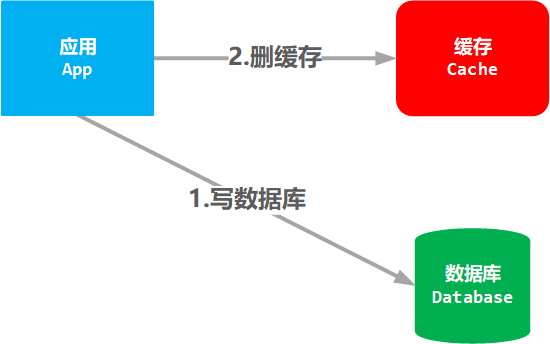
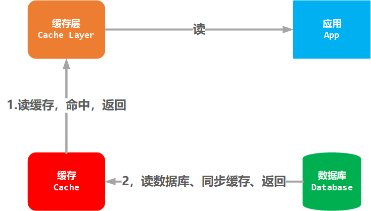
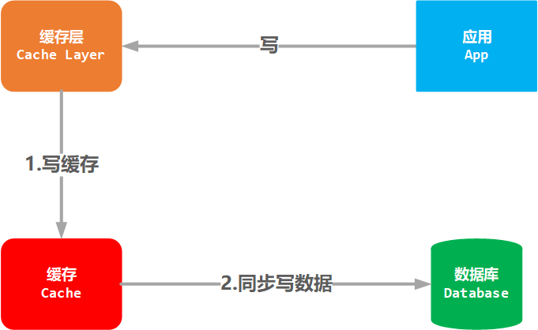

# 缓存模式

应用，缓存，数据库间，常见体系关系：

- Cache-Aside
- Read-Through, Write-Through, Read/Write-Through
- Write-Behind(Write-Back)
- Cache-Around

## Cache-Aside

缓存端模式，最常见的缓存模式：

- 读操作：先读缓存，若未命中，读数据库，再写入缓存
- 写操作：写数据库，再删除对应的缓存

读流程：

写流程图:

通常，缓存的生成是在读操作时，而不是在更新数据库后立即生成缓存。如此操作的一个重要原因是数据可能在下次读取前，被多次修改。写操作时，将数据关联的缓存清除。

Cache-Aside 模式在写操作时，会直接操作数据库，这样就会导致，在写操作时，整体存储模块的响应速度会大大降低。

## Read-Through，Write-Through

读穿透、写穿透模式。

这种模式，由独立缓存层来决定数据的来源和目标。与应用对接的只有应用缓存层，应用不用考虑缓存或是数据库。

缓存层主要的操作对象是缓存，由缓存层处理数据库：

- 读操作时：优先从缓存读取，若未命中，由数据读取，同步写入缓存。

- 当写数据时，先写缓存，同步写入数据库。

读流程图：

写流程图：

Read-through、Write-Through 模式通常在一起使用。

通过实现缓存层，达到高效读取，同步写数据的目的。整体思路与 Cache-Aside 类似，不过缓存层逻辑由独立的缓存层实现。

## Write-Behind(Write-Back)

后端写模式，类似于穿透读写模式，最大的差异在写操作同步数据库时，会采用异步模式，也就是先快速写缓存返回，再异步同步数据库。这样提升了应用写操作的效率。很多应用都会采用这类技术优化，也被称为缓存预写或其他方式预写（文件预写，日志预写）。

- 读操作：读缓存，若未命中，则读数据库，同步缓存，返回。（与 Read through 一样）
- 写操作：写缓存，立即返回，异步写数据库。

写流程图:

这个异步写，对于应用来说，就是后台程序，因此被称为 Back 或 Behind 模式。

异步写，会导致数据库和缓存出现较长时间的数据不一致性，这就意味着需要保证，当出现意外情况后，缓存和数据库可以同步。例如，需要为缓存增加日志，便于在出现意外时，可以同步缓存与数据库。

## Cache-Around

绕过缓存模式，哈哈，就是不用缓存模式。说白了，就是应用直接操作数据库。

